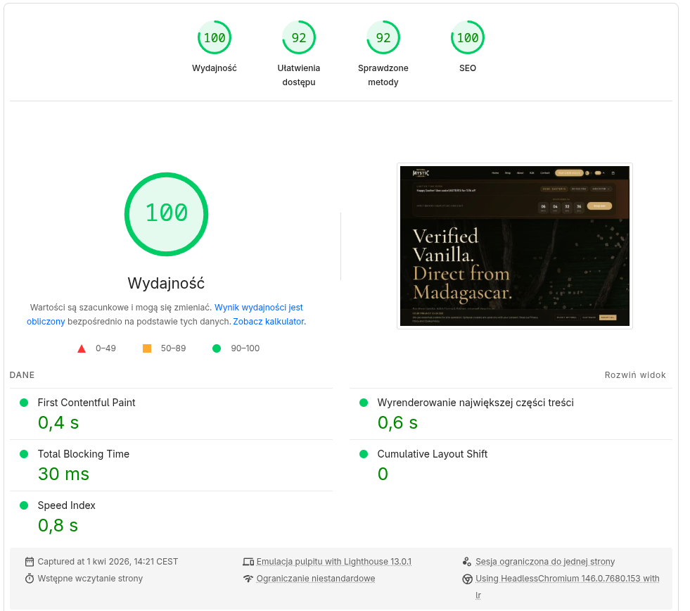
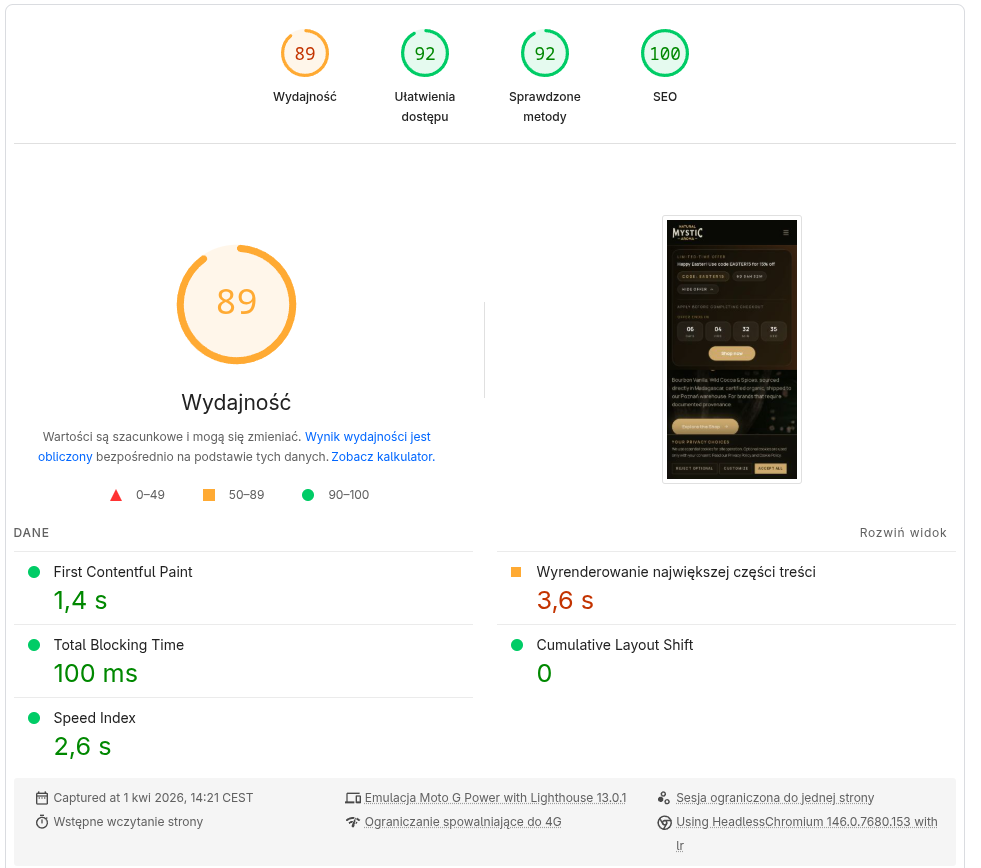
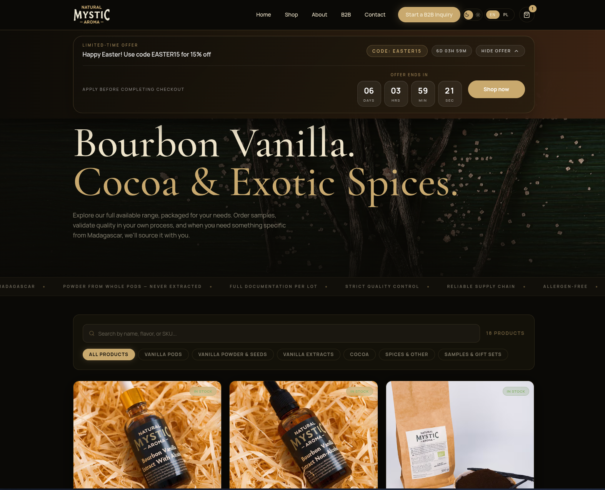
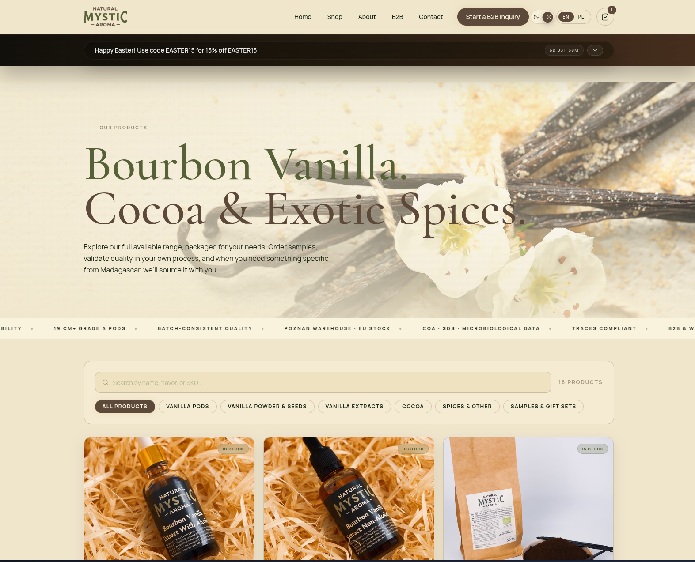
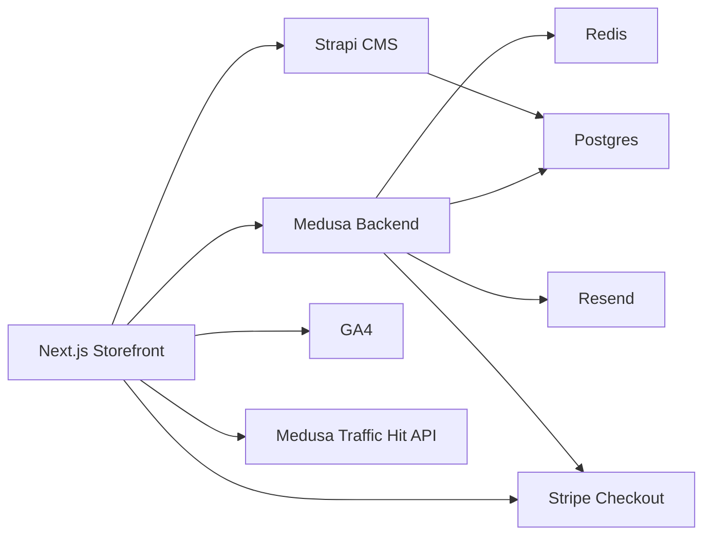

# Natural Mystic Aroma — Full-Stack E-Commerce Platform

Live site: [themysticaroma.com](https://themysticaroma.com)

I built this for my own company. Natural Mystic Aroma imports  Grade A Bourbon vanilla directly from Madagascar and sells B2B  across Europe. After years of running the business on off-the-shelf  tools that didn't fit how we actually operate, I built the entire  platform from scratch.

This is not a tutorial project. It handles real orders, real B2B  inquiries, real payments, and real customers across two languages  and multiple EU markets. I own the business, I built the platform,  and I maintain both.

---

## What I built and why

**The storefront** needed to feel like a premium brand, not a  generic WooCommerce template. Food manufacturers and pastry chefs  buying vanilla in bulk make decisions based on trust and  provenance - the site has to communicate that before they ever  fill out a form.

**The B2B inquiry flow** is custom because our sales process  doesn't fit standard e-commerce. Large orders go through a quote  request, manual review, and custom payment link - not a straight  add-to-cart checkout. I built that entire flow inside Medusa admin so Karol (operations) can manage it without touching code.

**The analytics and traffic layer** is first-party and cookieless by design - GDPR compliance isn't optional when selling across the EU, and I didn't want to depend entirely on GA4 consent rates for visibility into what's actually happening on the site. The baseline tracker records page-level traffic without personal identifiers: no cross-session profiling, no fingerprinting, no advertising use.

**The multilingual routing** covers Polish and English with  localized pathnames - `/pl/produkty` not just `/pl/products`.  The translation layer supports any locale without code changes - German, French, Italian are ready to activate at the content level. Built this way from the start because our B2B customers are spread across Europe and the system needs to grow with the market.

---

## Performance

Built for speed from the start - Next.js App Router with static 
generation where possible, optimised images via next/image, and 
minimal client-side JavaScript. Scores measured on a live 
production build with real third-party scripts running 
(Stripe, GA4, cookie consent).

| Metric | Mobile | Desktop |
|--------|--------|---------|
| Performance | 89 | 100 |
| Accessibility | 92 | 92 |
| Best Practices | 92 | 92 |
| SEO | 100 | 100 |





### Storefront




### Medusa admin


---

## Stack

- Next.js App Router storefront
- Medusa commerce backend with custom admin extensions
- Strapi CMS for editorial content ( future blog etc)
- Stripe for checkout and custom payment link workflows 
- PostgreSQL + Redis
- Docker Compose for local and VPS deployment
- Traefik reverse proxy on production

---

## Architecture



Full architecture notes: [`docs/architecture.md`](docs/architecture.md)

---

## What makes this non-standard

Most e-commerce projects use a platform and configure it. This one extends Medusa with custom admin routes - a leads CRM,  lead analytics dashboard, coupon management, and a traffic dashboard that combines GA4 data with first-party cookieless 
baseline tracking. None of that exists in Medusa out of the box. The payment link tooling is also custom. When a B2B lead submits  a quote request, ops can review it in the Medusa admin, generate a Stripe payment link scoped to that specific order, and send it directly - without the customer needing to go back through checkout.  Built this because the standard checkout flow doesn't work for large custom orders where price, quantity and shipping need manual confirmation first.

---

## Feature Map

| Area | What it covers |
| --- | --- |
| Theme system | Persisted light/dark, themed assets, no-flash init |
| Multilingual | Locale detection, localized route mapping, translated paths |
| Lead capture | Quote intake, validation, anti-spam, Medusa lead sink |
| Coupons | Public banner campaigns + private B2B discount codes |
| Analytics | GA4 + cookieless baseline traffic in Medusa admin |
| Stripe flows | Checkout, custom lead payment links, order payment links |
| Product i18n | Per-product metadata translations and locale detail blocks |

Full feature walkthrough: [`docs/features.md`](docs/features.md)

---

## Repository Layout

```text
.
|- app/                    Next.js App Router pages
|- components/             Storefront UI and interaction components
|- content/                Product and editorial data sources
|- docs/                   Architecture, features, decisions
|- public/                 Brand and product assets
|- services/medusa/        Commerce backend and custom admin extensions
|- services/strapi/        CMS
|- Dockerfile
|- docker-compose.yml
|- DEPLOY.md
```
---

## Running locally 
### First time setup

```bash
npm run stack:deps:up    # start Postgres and Redis first
npm run medusa:dev       # start Medusa backend
npm install && npm run dev  # start storefront
```

Opens at `http://localhost:3000`  
Medusa admin at `http://localhost:9000/app`

### Full stack
```bash
npm run stack:up
```

---

## Deployment

Three deployment paths documented depending on your setup:

- Standard VPS: [`DEPLOY.md`](DEPLOY.md)
- Shared reverse proxy: [`DEPLOY_SHARED_PROXY.md`](DEPLOY_SHARED_PROXY.md)
- Traefik on Hetzner VPS: [`DEPLOY_TRAEFIK.md`](DEPLOY_TRAEFIK.md)

## Additional docs

- [`docs/architecture.md`](docs/architecture.md)
- [`docs/code-tour.md`](docs/code-tour.md)
- [`docs/decisions.md`](docs/decisions.md)
- [`docs/features.md`](docs/features.md)

---

## What makes this non-standard

Most e-commerce projects use a platform and configure it. This one extends Medusa with custom admin routes - a leads CRM, lead analytics dashboard, coupon management, and a traffic dashboard that combines GA4 data with first-party cookieless baseline tracking. None of that exists in Medusa out of the box.

The payment link tooling is also custom. When a B2B lead submits a quote request, ops can review it in the Medusa admin, generate a Stripe payment link scoped to that specific order, and send it directly - without the customer needing to go back through checkout. Built this because the standard checkout flow doesn't work for large custom orders where price, quantity and shipping need manual confirmation first.

The site also includes `llms.txt` - the emerging standard for AI-readable site documentation, alongside `robots.ts` and `sitemap.ts` for search engine optimisation.

Live: [themysticaroma.com](https://themysticaroma.com)

--- 

## Contact 

Lukasz Kedzielawski  
lukasz@kedzielawski.com 
[kedzielawski.com](https://kedzielawski.com)
