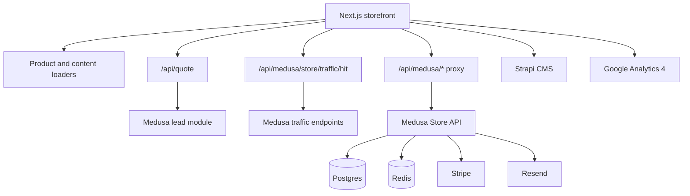

# Architecture

## Overview

This project is split into three major application surfaces:

1. `Next.js` storefront for the customer-facing experience
2. `Medusa` backend for commerce logic, admin extensions, leads, coupons, and analytics APIs
3. `Strapi` CMS for managed content

## High-Level Data Flow

## Storefront Layer

The Next.js application is responsible for:

- marketing pages and brand presentation
- product discovery and product detail rendering
- quote request capture
- cart and checkout UI
- locale-aware routing
- theme switching and themed assets
- analytics event dispatch

Main anchors:

- `app/`
- `components/`
- `proxy.ts`
- `lib/i18n.ts`

## Medusa Layer

Medusa goes beyond standard commerce setup in this project. It also acts as the operational dashboard for custom workflows.

Custom admin surfaces include:

- `services/medusa/src/admin/routes/leads/page.tsx`
- `services/medusa/src/admin/routes/leads-analytics/page.tsx`
- `services/medusa/src/admin/routes/coupons/page.tsx`
- `services/medusa/src/admin/routes/traffic/page.tsx`

Custom admin APIs include:

- `services/medusa/src/api/admin/leads/route.ts`
- `services/medusa/src/api/admin/leads/[id]/payment-link/route.ts`
- `services/medusa/src/api/admin/leads/[id]/special-order-link/route.ts`
- `services/medusa/src/api/admin/coupon-tools/route.ts`
- `services/medusa/src/api/admin/traffic/route.ts`
- `services/medusa/src/api/admin/traffic/baseline/route.ts`

## CMS Layer

Strapi is used as the content management layer for editorial or structured content workflows.

Main anchors:

- `services/strapi/`

## Analytics Strategy

The analytics model is intentionally split:

1. `GA4` for consented analytics and richer reporting
2. first-party baseline hit collection for cookieless aggregate traffic visibility

This gives the project:

- a privacy-aware fallback path
- operational visibility directly inside Medusa admin
- a separation between marketing analytics and internal baseline telemetry

