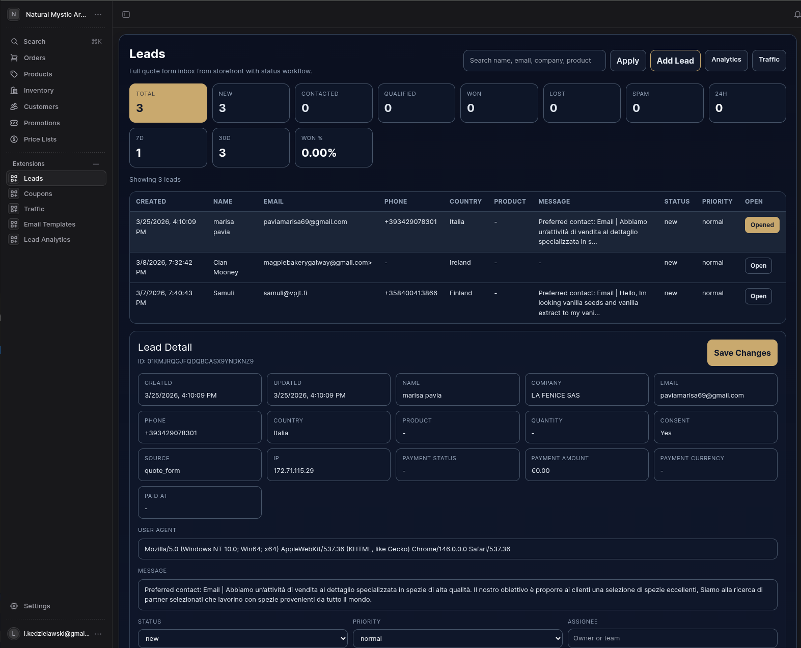
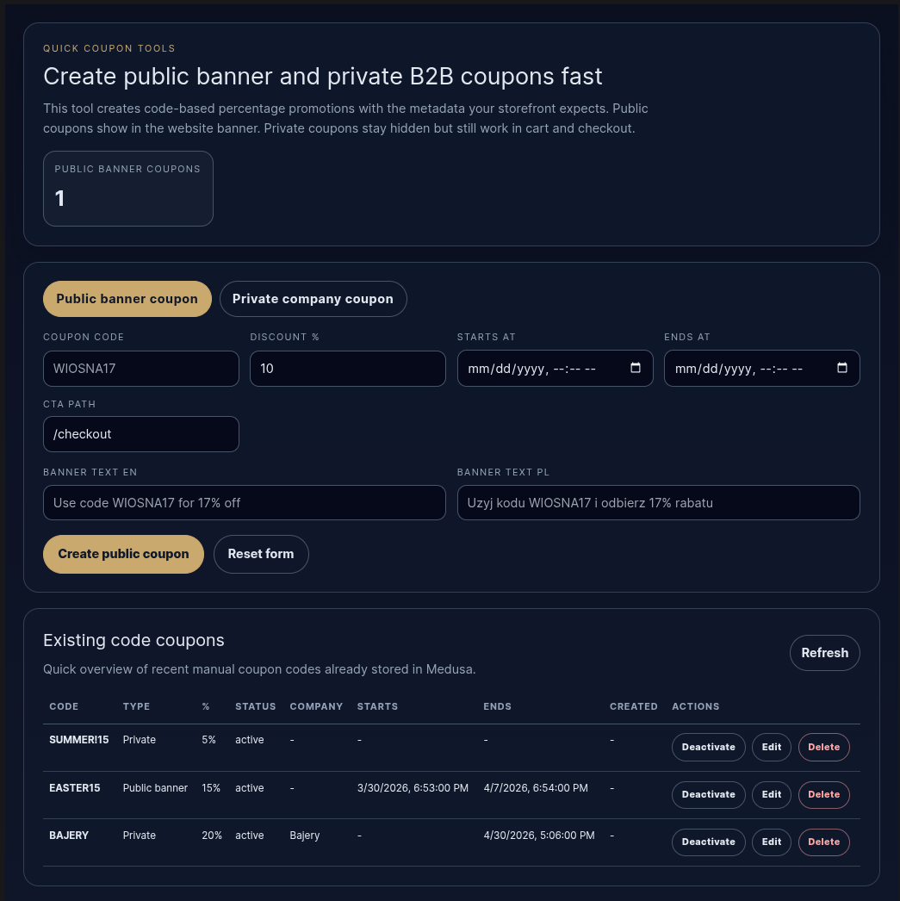
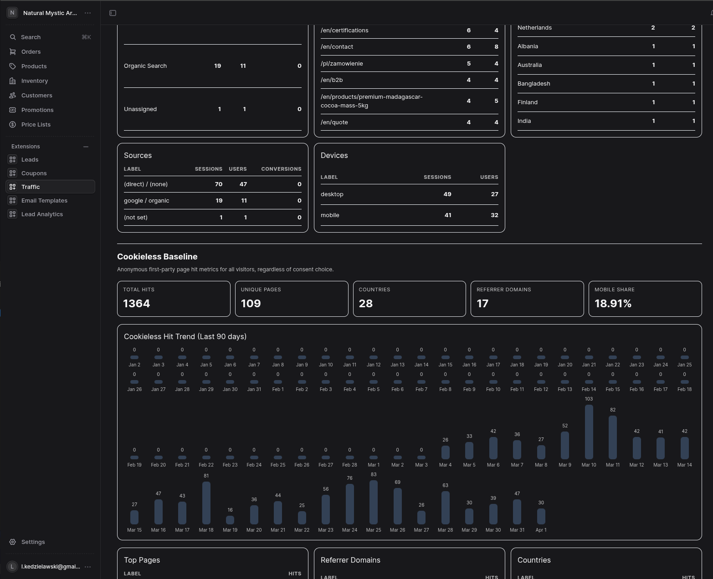

# Features

## Theme System

The storefront supports a persisted light/dark theme instead of relying on a one-off CSS toggle.

Implementation anchors:

- `app/layout.tsx`
- `components/theme-provider.tsx`
- `components/theme-toggle.tsx`
- `components/themed-image.tsx`

Notable behavior:

- theme is stored in `localStorage` under `nma-theme`
- the active theme is mirrored onto `document.documentElement`
- a pre-paint script prevents theme flicker on initial load
- brand assets swap automatically between dark and light variants

## Multilingual Routing

The storefront uses locale-aware routing with localized pathnames, not just translated labels.

Implementation anchors:

- `proxy.ts`
- `lib/i18n.ts`

Current public locale setup:

- `en`
- `pl`
- `de` (ready, not yet published on storefront)

Architecture supports any additional locale without code changes. German, French, Italian and others can be activated by adding translations to the product metadata i18n layer and content files.

Notable behavior:

- locale is inferred from URL, cookie, or `Accept-Language`
- locale preference is stored in the `nma_locale` cookie
- routes are localized, for example `/en/products` and `/pl/produkty`
- locale-specific product metadata is supported through Medusa metadata i18n

Reference doc:

- `docs/product-i18n-metadata.md`

## Lead Capture and CRM Workflow

Quote requests are not just emailed or dumped into a form inbox. They feed a structured Medusa lead workflow.

Implementation anchors:

- `components/request-quote-form.tsx`
- `app/api/quote/route.ts`
- `services/medusa/src/admin/routes/leads/page.tsx`
- `services/medusa/src/admin/routes/leads-analytics/page.tsx`

Notable behavior:

- required field validation
- honeypot spam protection
- rate limiting
- Medusa lead storage
- optional local backup in development
- manual lead creation inside admin
- payment-link generation from lead records

## Coupons and Campaigns

The coupon tooling is designed for business use, not just default admin screens.

Implementation anchors:

- `components/promo-banner.tsx`
- `components/coupon-code-form.tsx`
- `services/medusa/src/admin/routes/coupons/page.tsx`
- `services/medusa/src/api/admin/coupon-tools/route.ts`

Notable behavior:

- public banner coupons for on-site campaigns
- private company coupons for B2B use
- campaign metadata attached to coupon definitions
- edit, activate, deactivate, and delete flows
- countdown-oriented public campaign support

## Stripe Payments

The payment story includes both standard checkout and internal payment recovery / manual sales tooling.

Implementation anchors:

- `components/checkout-page.tsx`
- `services/medusa/src/admin/routes/leads/page.tsx`
- `services/medusa/src/admin/widgets/order-detailed-payment-link.tsx`
- `services/medusa/src/api/admin/orders/[id]/detailed-payment-link/route.ts`

Notable behavior:

- storefront checkout integration
- custom Stripe Checkout links for leads
- special-order payment link generation
- order-detail payment links with line-item breakdown
- payment status refresh inside admin

## Analytics

This project implements both consented analytics and first-party baseline analytics.

Implementation anchors:

- `components/analytics/ga4.tsx`
- `components/analytics/baseline-traffic.tsx`
- `services/medusa/src/admin/routes/traffic/page.tsx`
- `services/medusa/src/api/admin/traffic/route.ts`
- `services/medusa/src/api/admin/traffic/baseline/route.ts`

Notable behavior:

- GA4 integration for consented tracking
- cookieless baseline page-hit telemetry
- Medusa admin traffic dashboard
- combined operational visibility without depending only on third-party analytics

## Product Presentation

The storefront supports richer product storytelling than a plain catalog.

Implementation anchors:

- `app/products/[slug]/page.tsx`
- `components/product-gallery.tsx`
- `components/product-catalog.tsx`
- `services/medusa/src/admin/widgets/product-content-editor.tsx`

Notable behavior:

- custom overview blocks
- custom spec rows
- detail sections
- gallery and detail imagery
- locale-specific product metadata

## Deployment Readiness

This repository includes more than local dev support.

Reference files:

- `Dockerfile`
- `docker-compose.yml`
- `docker-compose.prod.yml`
- `docker-compose.prod.shared-proxy.yml`
- `docker-compose.prod.traefik.yml`
- `DEPLOY.md`
- `DEPLOY_SHARED_PROXY.md`
- `DEPLOY_TRAEFIK.md`
